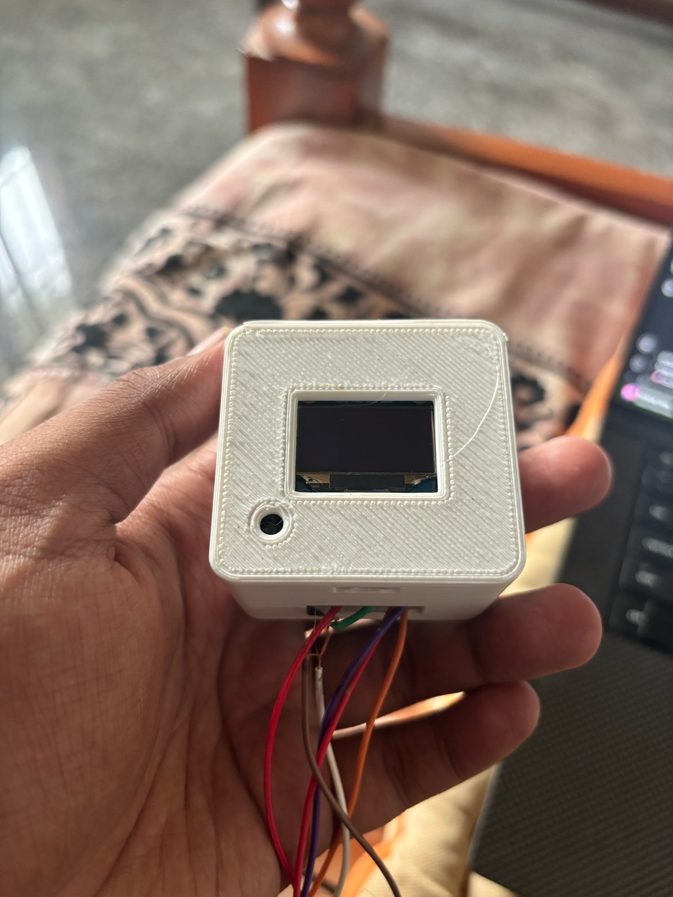
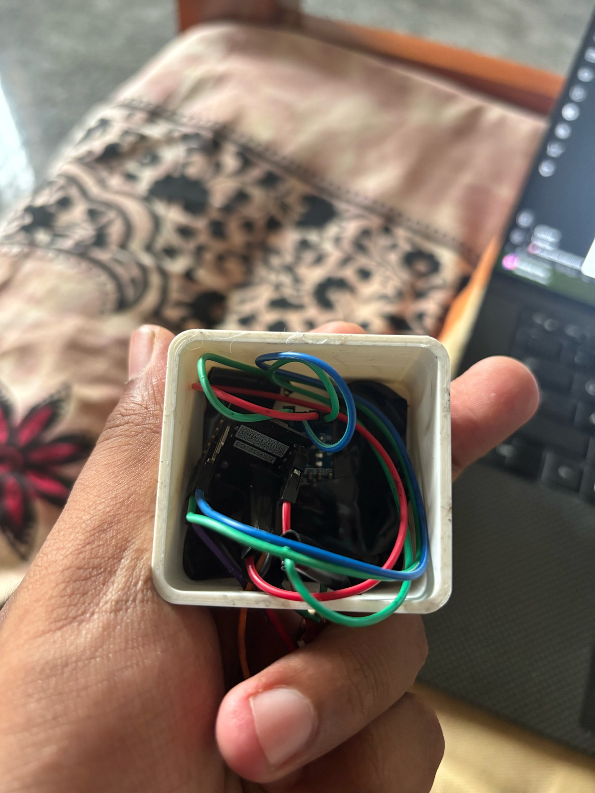
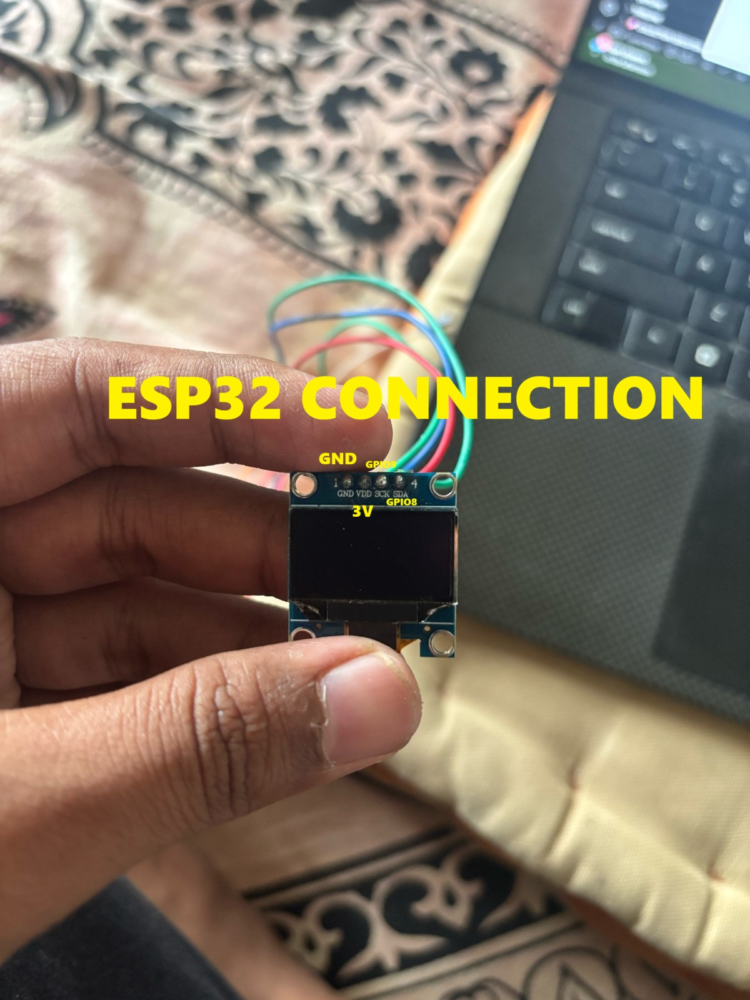
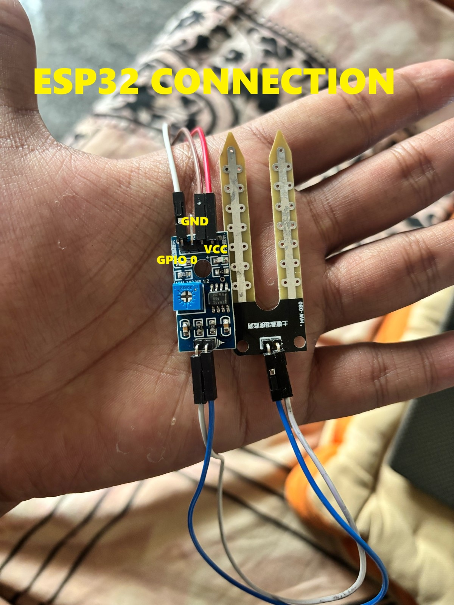
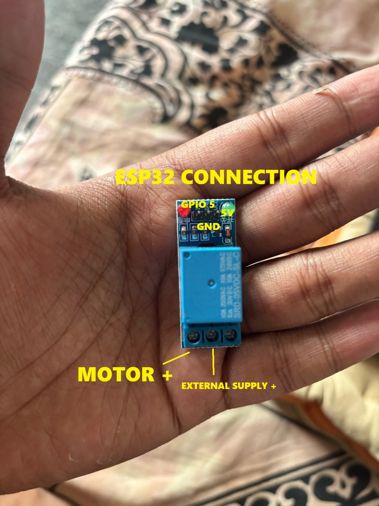

# 🌱 Plant Buddy — Automated Plant Watering Bot

> A DIY automated plant watering system using ESP32-C3 SuperMini.  
> Monitors soil moisture, waters your plant automatically, shows status on OLED, and provides a Wi-Fi web dashboard for control.

**Anyone can build this!** Follow the step-by-step guide below.

---

## What Does It Do?

1. **Reads soil moisture** — sensor tells the ESP32 how dry/wet the soil is.
2. **Auto-waters** — when soil is too dry, the relay turns ON the pump for a short burst.
3. **Shows live data** — OLED screen displays moisture %, pump status, and Wi-Fi IP address.
4. **Web dashboard** — connect your phone to the ESP32's Wi-Fi and control everything from a browser.
5. **Manual button** — press a physical button to water immediately.
6. **Remembers settings** — calibration and thresholds are saved even after power-off.

---

## Project Photos

### Finished Build (3D-Printed Enclosure)
| Front (OLED + Button) | Inside (ESP32-C3 + Wiring) |
|:---:|:---:|
|  |  |

### Component Connections
| OLED Display | Soil Moisture Sensor | Relay Module |
|:---:|:---:|:---:|
|  |  |  |

---

## Shopping List (What You Need to Buy)

| # | Component | Approx. Cost | Where to Buy |
|---|-----------|-------------|--------------|
| 1 | ESP32-C3 SuperMini | ~₹250 / $3 | AliExpress, Amazon |
| 2 | 0.96" or 1.3" OLED (I2C, 128x64, SSD1306) | ~₹150 / $2 | Amazon, Robu.in |
| 3 | Soil Moisture Sensor (analog output, with comparator board) | ~₹50 / $1 | Amazon |
| 4 | 5V Relay Module (1-channel, active-low) | ~₹40 / $1 | Amazon |
| 5 | Mini Water Pump (3-6V DC submersible) | ~₹80 / $1.5 | Amazon |
| 6 | 5V Power Supply / USB adapter (for pump) | ~₹100 / $2 | Any phone charger works |
| 7 | Push Button (normally open) | ~₹10 / $0.2 | Electronics shop |
| 8 | Jumper wires (female-to-female, male-to-female) | ~₹50 / $1 | Amazon |
| 9 | Silicone tubing (4-6mm, for water) | ~₹50 / $1 | Amazon |
| 10 | (Optional) 3D-printed case | — | Print from `cad/` folder STL files |

**Total cost: approximately ₹780 / $12**

---

## Step-by-Step Build Guide

### Step 1: Understand the System

```
┌─────────────────────────────────────────────────────────────────────────┐
│                                                                         │
│   [Soil Sensor] ──analog──► [ESP32-C3] ──GPIO5──► [Relay] ──► [Pump]   │
│                                 │                                       │
│                            [OLED Screen]                                │
│                            [Button]                                     │
│                            [Wi-Fi Dashboard]                            │
│                                                                         │
└─────────────────────────────────────────────────────────────────────────┘
```

**How it works:**
- The soil sensor outputs an analog voltage (low = wet, high = dry).
- ESP32 reads it, calculates moisture %, and decides if watering is needed.
- If soil is dry → ESP32 sends LOW signal to relay → relay closes → pump runs.
- OLED + web dashboard show real-time info.

---

### Step 2: Pin Connections (IMPORTANT — Follow Exactly)

#### ESP32-C3 SuperMini Pin Map

| ESP32 Pin | Connects To | Wire Color (suggested) | Purpose |
|-----------|-------------|----------------------|---------|
| **GPIO0** | Soil sensor AO (analog out) | Blue | Read moisture level |
| **GPIO4** | Push button (other leg to GND) | Yellow | Manual water trigger |
| **GPIO5** | Relay IN pin | Green | Control pump ON/OFF |
| **GPIO8** | OLED SDA pin | Blue/White | OLED data |
| **GPIO9** | OLED SCL pin | Green/White | OLED clock |
| **3.3V** | OLED VCC + Soil sensor VCC | Red | Power to sensors |
| **5V** | Relay VCC | Red | Power to relay module |
| **GND** | OLED GND + Sensor GND + Relay GND + Button | Black | Common ground |

---

### Step 3: Wire the OLED Display

```
OLED Module          ESP32-C3 SuperMini
──────────           ──────────────────
   GND   ──────────►  GND
   VCC   ──────────►  3.3V  (or 3V pin)
   SCL   ──────────►  GPIO9
   SDA   ──────────►  GPIO8
```

> **Tip:** The OLED has 4 pins. Match GND-VCC-SCL-SDA carefully. Wrong VCC/GND will NOT damage it but nothing will display.

---

### Step 4: Wire the Soil Moisture Sensor

```
Soil Sensor Board    ESP32-C3 SuperMini
─────────────────    ──────────────────
   GND   ──────────►  GND
   VCC   ──────────►  3.3V
   AO    ──────────►  GPIO0  (analog output)
```

> **Note:** Use the **AO** (analog) pin, NOT the DO (digital) pin.  
> The sensor also has a separate 2-pin connector going to the fork probes — just plug that in.

---

### Step 5: Wire the Relay Module (Controls the Pump)

```
Relay Module         ESP32-C3 SuperMini
────────────         ──────────────────
   IN    ──────────►  GPIO5
   GND   ──────────►  GND
   VCC   ──────────►  5V

Relay Screw Terminals (high-voltage side):
   COM   ──────────►  Pump (+) wire
   NO    ──────────►  External 5V supply (+)

Pump (-) wire ──────► External 5V supply GND
                      External supply GND ──► ESP32 GND (MUST share ground)
```

**How the relay works:**
- When GPIO5 = HIGH → Relay OFF → Pump stops
- When GPIO5 = LOW → Relay ON → Pump runs
- The relay acts as a switch between your pump and the 5V power supply

> ⚠️ **NEVER** connect the pump directly to ESP32 pins. The pump draws too much current and will kill the chip.

---

### Step 6: Wire the Manual Button

```
Push Button          ESP32-C3 SuperMini
───────────          ──────────────────
   Leg 1  ──────────►  GPIO4
   Leg 2  ──────────►  GND
```

> **That's it!** The firmware uses internal pull-up. When you press the button, it connects GPIO4 to GND, which triggers a manual watering cycle.

---

### Step 7: Power Everything

**Option A: Single USB cable (recommended for testing)**
- Plug USB-C into the ESP32-C3 SuperMini
- This powers the ESP32 + OLED + Sensor
- For the pump, you need a separate 5V supply to the relay screw terminals

**Option B: External 5V supply powers everything**
- Feed 5V to ESP32's 5V pin and to relay/pump
- Share GND across all components

> ⚠️ **The pump MUST have its own 5V supply.** Don't try to run the pump from the ESP32 USB port — it can't provide enough current.

---

### Step 8: Upload the Firmware

#### Prerequisites
1. Install [VS Code](https://code.visualstudio.com/)
2. Install the **PlatformIO** extension (search "PlatformIO IDE" in Extensions)

#### Upload Steps
1. Open this project folder in VS Code
2. Connect ESP32-C3 SuperMini via USB-C cable
3. Wait for PlatformIO to install dependencies (first time takes a minute)
4. Click the **→ (Upload)** button in the PlatformIO toolbar at the bottom
   - Or run in terminal: `pio run -t upload`
5. Click the **🔌 (Serial Monitor)** button to see output at 115200 baud

**If upload fails:**
- Hold the BOOT button on ESP32 while clicking Upload
- Make sure the USB cable supports data (some are charge-only)
- Install CP2102/CH340 USB drivers if your OS doesn't detect the board

---

### Step 9: Connect to the Dashboard

1. After upload, the OLED will show the device IP address
2. On your phone/laptop, connect to Wi-Fi:
   - **SSID:** `PlantBuddy-C3`
   - **Password:** `plantbuddy123`
3. Open a browser and go to the IP shown on OLED (usually `192.168.4.1`)
4. You'll see the web dashboard with live moisture data and controls

> **Optional:** To connect to your home Wi-Fi instead of AP mode, edit these lines in `src/main.cpp`:
> ```cpp
> static const char* WIFI_SSID = "YourWiFiName";
> static const char* WIFI_PASSWORD = "YourWiFiPassword";
> ```

---

### Step 10: Calibrate the Sensor (MUST DO)

Every soil sensor is slightly different. You need to tell the system what "dry" and "wet" look like for YOUR sensor.

1. Open the web dashboard
2. **Keep the sensor probe in AIR (completely dry)**
   - Click **"Set Dry"** button on dashboard
   - This saves the current ADC reading as the "dry" reference
3. **Put the sensor probe fully into WATER (or very wet soil)**
   - Click **"Set Wet"** button on dashboard
   - This saves the current ADC reading as the "wet" reference
4. Set your preferred thresholds:
   - **Low threshold** (default 35%) — pump starts when moisture drops below this
   - **Target threshold** (default 55%) — pump stops when moisture rises above this
5. Click **"Save Settings"** — values are stored permanently

---

## System Block Diagram (Detailed)

```
                         ┌──────────────────────────────────┐
                         │      ESP32-C3 SuperMini          │
                         │                                  │
   ┌─────────────┐      │  GPIO8 (SDA) ◄──── I2C ────►    │      ┌──────────────────┐
   │  1.3" OLED  │◄────►│  GPIO9 (SCL)                    │      │  Soil Moisture   │
   │  (SSD1306)  │      │                                  │◄─────│  Sensor (AO)     │
   │  128x64 I2C │      │  GPIO0 (ADC) ◄── Analog In      │      │  Analog Output   │
   └─────────────┘      │                                  │      └──────────────────┘
                         │  GPIO5 (OUT) ──► Relay IN         │
                         │                      │           │      ┌──────────────────┐
                         │                      ▼           │      │   5V Water Pump  │
                         │               ┌───────────┐      │      │                  │
                         │               │   RELAY   │──────┼─────►│  (via NO/COM)    │
                         │               └───────────┘      │      └──────────────────┘
                         │                                  │
   ┌─────────────┐      │  GPIO4 (IN_PULLUP) ◄── Button   │      ┌──────────────────┐
   │ Push Button │──────►│                                  │      │  External 5V PSU │
   │ (Manual)    │      │  GPIO1 (IN_PULLUP) ◄── Tank Sw  │──────│  (Pump Power)    │
   └─────────────┘      │                                  │      └──────────────────┘
                         │  Wi-Fi (AP/STA)                  │
   ┌─────────────┐      │      ▲                           │
   │  Phone/PC   │◄────►│      │ HTTP Web Dashboard        │
   │  Browser    │      │                                  │
   └─────────────┘      └──────────────────────────────────┘
```

---

## Dashboard Controls Explained

| Button | What It Does |
|--------|-------------|
| **Water Now** | Immediately turns on pump for a short burst (manual watering) |
| **Toggle Auto** | Enable/disable automatic watering logic |
| **Set Dry** | Save current ADC reading as the "dry soil" calibration point |
| **Set Wet** | Save current ADC reading as the "wet soil" calibration point |
| **Save Settings** | Write all values to flash memory (survives reboot/power-off) |

**Live display shows:** Moisture %, raw ADC value, pump ON/OFF status, tank level (if connected)

---

## Settings Reference

| Setting | What It Means | Default |
|---------|--------------|---------|
| Dry ADC | ADC reading when sensor is in dry air | 4005 |
| Wet ADC | ADC reading when sensor is in water | 1921 |
| Low Threshold | Start watering when moisture drops below this % | 35% |
| Target Threshold | Stop watering when moisture rises above this % | 55% |
| Pump Run Time | How long pump runs per auto-water cycle | 700 ms |
| Cooldown | Minimum wait between auto-water cycles | 90 seconds |
| Manual Pump Time | How long pump runs when you press the button | 600 ms |

---

## Troubleshooting

| Problem | Solution |
|---------|----------|
| OLED blank | Check SDA/SCL wires. Try swapping them. Ensure OLED address is 0x3C |
| Moisture always 0% or 100% | Run calibration (Set Dry + Set Wet). Check AO wire to GPIO0 |
| Pump won't turn on | Check relay wiring. Ensure external 5V supply is connected. Check COM/NO terminals |
| Can't upload firmware | Hold BOOT button during upload. Try a different USB cable |
| Can't find Wi-Fi | Wait 10 seconds after power-on. SSID is `PlantBuddy-C3` |
| Dashboard not loading | Make sure you're connected to PlantBuddy Wi-Fi, then open `192.168.4.1` |
| Pump runs non-stop | Calibration is wrong — redo Set Dry / Set Wet. Check threshold values |

---

## Project Structure

```
plant-buddy/
├── platformio.ini              # Build config + library dependencies
├── README.md                   # This guide
├── images/                     # Photos of the build
├── cad/                        # 3D-printable enclosure files
│   ├── plantbuddy_back.scad    # Back cover (OpenSCAD source)
│   ├── plantbuddy_front.scad   # Front panel with OLED cutout
│   └── stl/                    # Ready-to-print STL files
└── src/
    └── main.cpp                # Complete firmware (single file)
```

---

## Optional: 3D-Printed Case

STL files are in the `cad/stl/` folder. Print with:
- Material: PLA or PETG
- Layer height: 0.2mm
- Infill: 20%
- No supports needed

The case has a cutout for the OLED display and a hole for the manual button.

---

## Optional: Tank Level Switch

If you want the system to stop watering when the water tank is empty:

1. In `src/main.cpp`, change: `static const bool USE_TANK_SENSOR = true;`
2. Connect a float switch between **GPIO1** and **GND**
3. When tank is empty, the switch opens → GPIO1 reads HIGH → pump won't run

---

## License

MIT — Free to use, modify, and share.
